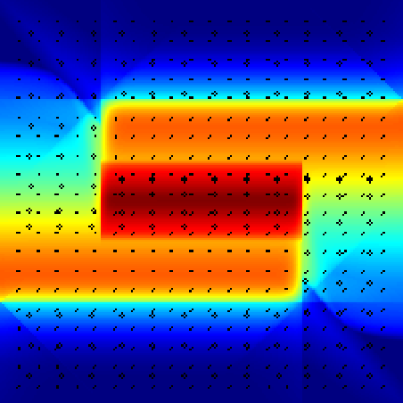
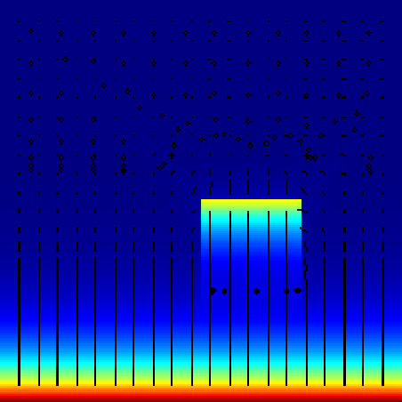

# lattice Boltzmann Bhatnagher-Gross-Krook simple fluid simulator

This is a really precarious and simple implementation of a method I recently came across and decided to try given its sheer simplicity. My references were [this](https://web.archive.org/web/20081112022707/http://www.science.uva.nl/research/scs/projects/lbm_web/lbm.html) page and the [wikipedia](https://en.wikipedia.org/wiki/Lattice_Boltzmann_methods) page for the methods.

The simulation itself is contained within the 28 lines following line 62. The rest is basically for visualisation and setting up variables.

It's not working perfectly yet, but some simple simulations are already possible and those results look rather accurate (definitely more than I expected).

## Examples

### Vortex formation
For this first example, I configured two misaligned line segments containing "particles" moving at opposite directions. By letting the simulation run, the expected result is a rotating motion in the centre.

There seem to be some artifacts near the corners, but the main effect seems to have worked (pay attention to the streamlines).

### Flow around obstacles

I haven't implemented wall collisions yet, but it's possible to simulate something similar by using a small flow on the opposite direction of a bigger one.

## Explanation

This was a one-day prototype, and as such, it was done using the smallest time possible, even if it wasn't very efficient. For that, I decided to represent the lattice as a tensor containing the 9 directions for each point on the grid (represented by a numpy array with shape (9,size,size)).

The local velocities were also represented as a tensor in the equilibrium calculation.

The rest of it is basically the same as the paper with a slight difference:

For the streaming phase, I calculated yet another tensor with the weights of each direction in the final calculation (given by the relative probabilities of each one). Given that tensor, each point's directions will be determined as a weighted sum of its current value and its neighbour's value weighed by that direction.

Using numpy, those tensors and the above approximation, the calculations can be done much faster than by applying the algorithm naïvely, allowing for real-time processing for fairly large lattices (300X300 was my default for tests, and what was used on the examples above) without really thinking about optimisations or improvements.

Well, obviously optimisations and improvements are possible. This code is far from finished or even functional.

---
Made with <3 By Amélia O.